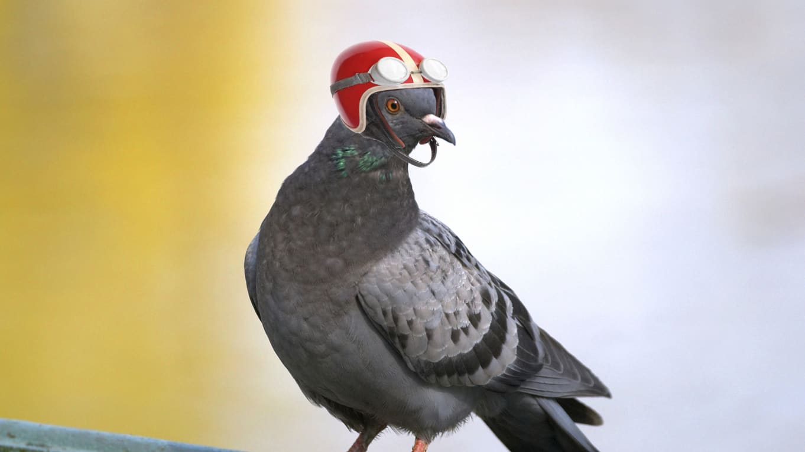
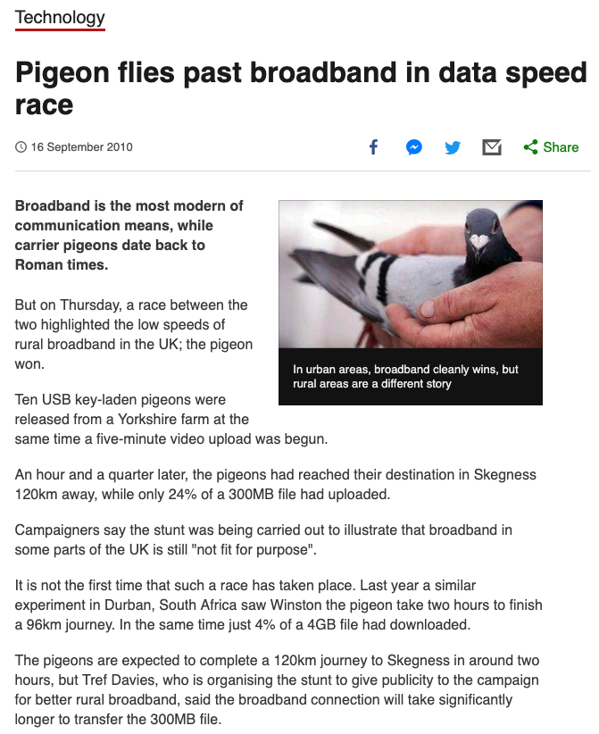

# Big O(h boy!) and You

### learn it &bull; live it &bull; love it

<!-- .slide: data-transition="zoom" -->

---

# What is big o?

- Big-O notation is a relative representation of the complexity of an algorithm. ([from stackoverflow](https://stackoverflow.com/questions/487258/what-is-a-plain-english-explanation-of-big-o-notation))

  <!-- .element: class="fragment fade-up" -->

- Big O notation is the language we use for talking about **_how long_** [and ***how much space***] an algorithm takes to run. It's how we compare the efficiency of different approaches to a problem. ([from interviewcake.com](https://www.interviewcake.com/article/ruby/big-o-notation-time-and-space-complexity))
  <!-- .element: class="fragment fade-up" -->

Note:
question for class: what is big O?

---

## Who will win?

<p style="font-size: 0.3em; margin-top:0px;"><br/>Photo Illustration by Emil Lend of/The Daily Beast</p><!-- .element: class="fragment fade-in" -->

<!-- <p style="font-size: 0.3em; margin-top:0px;">Photo Illustration by Emil Lend of/The Daily Beast</p>.element: class="fragment fade-in" -->

#### VS.<!-- .element: class="fragment fade-in" -->

<!-- .element: class="fragment fade-in" -->

Note:

- we want to send an awesome video to a coworker accross town&mdash;which will be faster

  - (a) save the video to a stick drive, tie the stick drive to a pigeon, and send it on over
  - (b) send it over the internet

- 120Km in South Africa

---



Note:

- reminder: efficiency of an algorithm => we can think about this in terms of **time** and **space**
- we spend a lot of time thinking about **time** in comparison to **space** because **space** is cheaper now
- Both are in terms of input

- we can assume the pigeons fly at a constant average rate and along the same route each time

---

`O(1)` vs. `O(n)` where `n = filesize`

---

<ul style="float:left">
    <li class="fragment fade-in">
        Constant
    </li>
    <li class="fragment fade-in">
        Logarithmic
    </li>
    <li class="fragment fade-in">
        Square Root
    </li>
    <li class="fragment fade-in">
        Linear
    </li>
    <li class="fragment fade-in">  
        Log-Linear
    </li>
    <li class="fragment fade-in">
        Quadratic
    </li>
    <li class="fragment fade-in">
        Polynomial
    </li>
    <li class="fragment fade-in">
        Exponential
    </li>
    <li class="fragment fade-in">
        Factorial
    </li>
</ul>


<div style="clear:both;">&nbsp;</div>

---

It's all a matter of counting!

---

```javascript
function randomMath(n) {
  let result = n;
  result = 3 * result + 2;
  result += 40 * result;
  result = 5 * result;
  return result;
}
```

Note:

- in terms of time, each step is +1 unless it is in relation to our input
- each adjacent step is addition
- does the number of steps depend on our input size?

---

| time  | O(1) |
| ----- | ---- |
| space | O(1) |

---

```javascript
function printNTimes(n) {
  for (let i = 0; i < n; i++) {
    console.log(i);
  }
}
```

Note:

- loops usually signify some kind of operation in terms of n

---

| time  | O(n) |
| ----- | ---- |
| space | O(1) |

---

```javascript
function bubbleSort(array) {
  let swapped = true;

  while (swapped) {
    swapped = false;

    for (let i = 0; i < array.length - 1; i++) {
      if (array[i] > array[i + 1]) {
        [array[i], array[i + 1]] = [array[i + 1], array[i]];
        swapped = true;
      }
    }
  }

  return array;
}
```

Note:

- loop within a loop => higher order
- two levels of loops => 2nd power
- Typical pattern.
- The number of things to do each time is not always n

---

| time  | O(n<sup>2</sup>) |
| ----- | ---------------- |
| space | O(1)             |

---

```javascript
function binarySearch(array, target) {
  if (array.length === 0) {
    return false;
  }

  let midIdx = Math.floor(array.length / 2);
  let leftHalf = array.slice(0, midIdx);
  let rightHalf = array.slice(midIdx + 1);

  if (target < array[midIdx]) {
    return binarySearch(leftHalf, target);
  } else if (target > array[midIdx]) {
    return binarySearch(rightHalf, target);
  } else {
    return true;
  }
}
```

---

| time  | O(logn)    |
| ----- | ---------- |
| space | O(n\*logn) |

---

- Typical of logarithmic time complexity: Reducing the data set by a factor each time.
- We must consider the stack call we are making in each recursive step as a unit of space
- `Array.prototype.slice()` creates a new array&mdash;Consider how we might reduce space complexity. What trade-offs are we making to do so?

---

```javascript
const sampleMatrix = [
  [0,1,1,1,0],
  [1,0,0,1,1],
  [0,0,0,1,"hello"]
]

function printMatrix(matrix) {
  for (let row = 0; row < matrix.length; row++) {
    for (let col = 0; col < matrix[row].length; col++) {
      console.log(matrix[row][col]);
    }
  }
}
```

---

| time  | O(n \* m), where n = number of rows and m = number of columns |
| ----- | ------------------------------------------------------------- |
| space | O(1)                                                          |

---

- Lengths of both outer array and subarrays have an impact on the overall complexity of this function
- we want to consider their individual impact on the number of steps required and express that in terms of Big O
- in this case, `m` steps are nested in each of the `n` steps => `O(n * m)` or `O(nm)`

---

```javascript
fucntion evenOrDoSomeWork(num)
  if (num % 2 === 0 || num < 0 ) return 1;
  console.log( "working ...");
  evenOrDoSomeWork(num-2);
end
```

---

| time  | O(n) |
| ----- | ---- |
| space | 0(n) |

note:
Best Case: Constant
_*Worst Case:*_ Linear

---

```javascript
function fibonacci(number) {
  if (number <= 1) return number;
  return fibonacci(number - 2) + fibonacci(number - 1);
}
```

---

| time  | O(2<sup>n</sup>) |
| ----- | ---------------- |
| space | O(n)             |

---

- This is a branching recursive tree. Since each call results in two more calls, we multiply by two for each level of the tree.
- Based on our input and base case, the total number of calls is `2^(n-2) + 3` => `O(2^n)`
- In terms of space complexity, we need to consider the maximum depth of the recursive calls `O(n)`

---

```javascript
function fibonacciOddShoutOut(number) {
  if (number <= 1) return number;
  if (number % 2 !== 0) {
    for (let i = 0; i < number; i++) {
      console.log(`Odd Number Y'all!!!`);
    }
  }
  return fibonacci(number - 2) + fibonacci(number - 1);
}
```

---

| time  | O(n \* 2<sup>n</sup>) |
| ----- | --------------------- |
| space | O(n)                  |

---

- fibonacciOddShoutOut is a branching tree which gives us a lower bound of `O(2^n)`
- However, there is extra stuff going on. Sometimes we do extra stuff that depends on `n`.
- If there were `n` things going on for each recursive call, then our time complexity would be `O(n*2^n)`. This is the upper bound
- Counting up exactly how much stuff is going on, given that only odd numbers result in extra work, is outside the scope of what you should expect to be able to do in an interview. It is a fun math challenge to try though!

---

```javascript
function digify(num) {
  let tempNum = 0;
  for (let i = 0; i < num; i++) {
    for (let i = 0; i < num; i++) {
      tempNum
        .toString(10)
        .split("")
        .forEach(el => {
          console.log(el);
        });
    }
    tempNum++;
  }
  console.log(tempNum);
}
```

---

| time  | O(n<sup>2</sup> \* logn) |
| ----- | ------------------------ |
| space | O(1)                     |

---

- The key question here is: What is contained in the double loop?

- For each iteration we do extra work equal to the number of digits of the current number. Do you see that?

- The number of digits is roughly equal to `log10(n)`

---

- If we count everything up we get

Sum from i=1 to n<sup>2</sup> of log10(i)

- This should give us a Time Complexity of around `O(n^2 * log10(n^2))`; once we normalize the base of the logarithm and discard the constant factor this is `O(n^2 * logn)`.

- For `n=100` the total number of prints is 38,890;

---

```javascript
function avoidThisComplexity(num) {
  if (num <= 1) return 1;
  return num * avoidThisComplexity(num - 1);
}
```

---

| time  | O(n!) |
| ----- | ----- |
| space | O(n)  |

- Factorial: `n=5` results in 4 more calls, each of which results in 3 more calls...etc.

---

<h3>General Approach</h3>
<ul>
  <li>
    Identify n (or necessary variables)
  </li>
  <li>
    Walk through algorithm tracking step/space in terms of n &mdash; add adjacent steps; multiply blocks within blocks; etc. 
  </li>
  <li>
    Consider how recursion affects space and time complexity
  </li>
  <li>
    Eliminate all but highest order term
  </li>
  <li>
    Eliminate coefficients 
  </li>
</ul>
